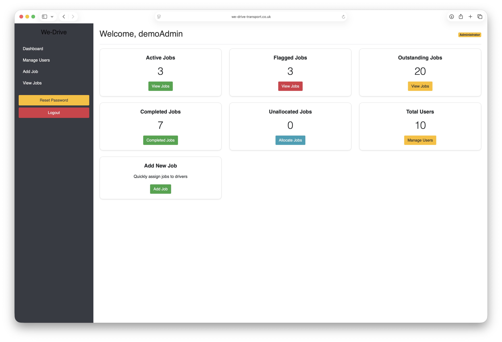
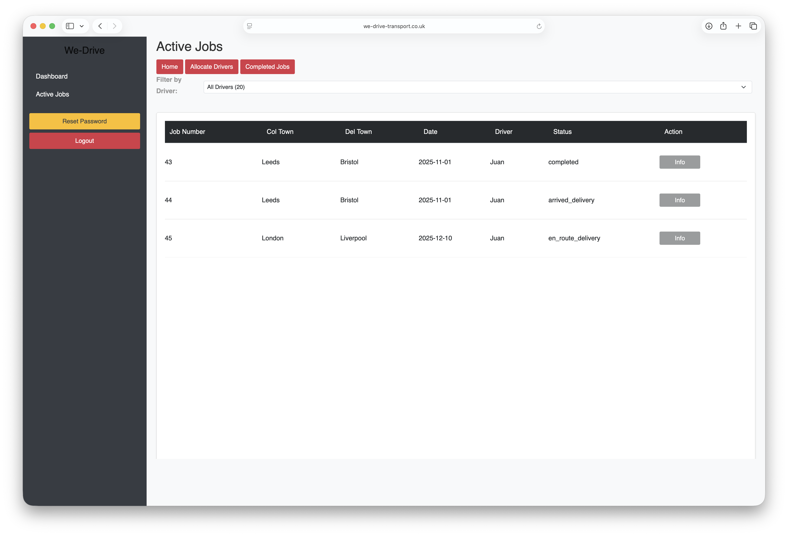
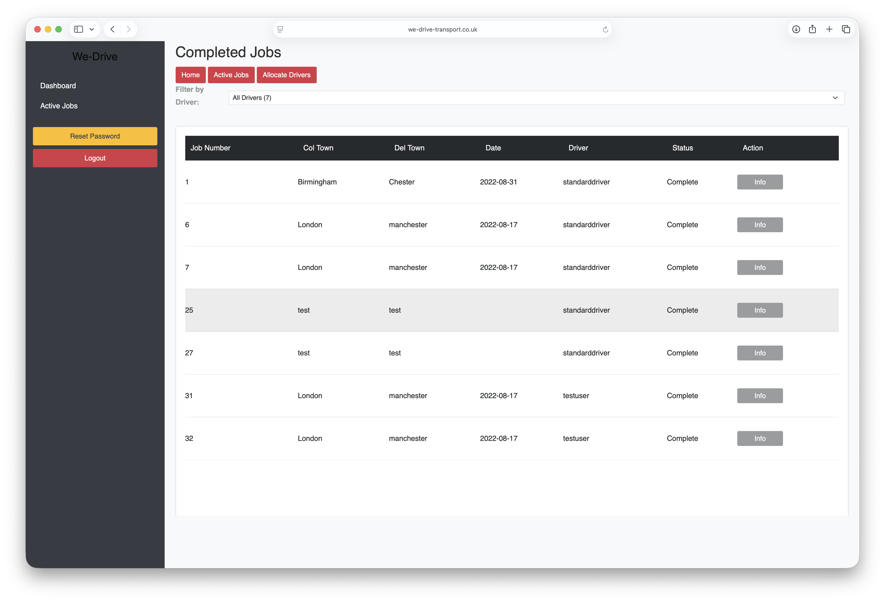

# 🚚 We-Drive Logistics System

**Built by drivers, for drivers.**

We-Drive is a web-based logistics and driver management platform developed to streamline transport operations and reduce administrative workload through digital workflows.

The system was originally developed as part of a BSc (Honours) Computing & IT and Design project, then expanded into a practical logistics management platform inspired by real-world transport industry experience.

---

## 🌐 Live Demo

### Demo Website

https://we-drive-transport.co.uk/login.php

### Demo Accounts

**Administrator Access**

Username: `demoAdmin`
Password: `demo1234!`

**Driver Access**

Username: `demoUser`
Password: `demo1234!`

---

## 📌 Overview

We-Drive is designed to help transport operators manage deliveries, allocate drivers, track job progress and monitor operational activity from a central dashboard.

The aim of the project was to reduce paperwork, improve job visibility and create a simple digital workflow suitable for both office administrators and drivers.

---

## ✅ Features

### User Management

* Secure user authentication
* Administrator and driver access levels
* Role-based access control
* User administration

### Job Management

* Create and manage transport jobs
* View active jobs
* View completed jobs
* Track job status throughout the workflow
* Store detailed collection and delivery information

### Driver Allocation

* Allocate drivers to jobs
* View unallocated jobs
* Manage active driver workloads
* Monitor job progress by driver

### Vehicle Information

* Store vehicle details
* Record VIN information
* Support vehicle movement operations

### Operational Workflow

* Collection and delivery tracking
* Digital job management
* Reduced paperwork and manual administration
* Centralised dashboard reporting

---

## 🖥️ Screenshots

### Dashboard

The administrator dashboard provides an overview of transport operations, including active jobs, completed jobs, flagged jobs, outstanding jobs, unallocated work and user management statistics.

---

### Active Job Management

Administrators can view, filter and manage active transport jobs. This screen shows driver allocation, delivery status tracking and job detail actions.

---

### Completed Jobs

Completed job history provides visibility of finished work, driver activity and operational records.

---

## 🛠️ Technology Stack

### Backend

* PHP
* MySQL

### Frontend

* HTML5
* CSS3
* JavaScript
* Bootstrap

### Tools

* Visual Studio Code
* Git
* GitHub

---

## 🔧 Technical Highlights

This project demonstrates practical experience with:

* PHP session-based authentication
* Role-based access control
* Relational database design using MySQL
* CRUD operations
* Dynamic dashboard reporting
* Server-side filtering and data management
* Responsive user interface development
* Business workflow automation
* Full-stack web application deployment

---

## 🧩 Challenges Solved

* Designing a database structure capable of managing users, jobs and vehicles
* Implementing separate administrator and driver user roles
* Creating a transport workflow that mirrors real-world operational processes
* Building reporting dashboards from live database information
* Maintaining a simple interface suitable for both office staff and drivers
* Reducing manual administration through digital job tracking

---

## 🎓 Project Background

The project was designed around real-world logistics processes and challenges encountered within the vehicle transport industry.

It was originally created as part of a BSc (Honours) Computing & IT and Design project and has since been developed further as part of my software development portfolio.

The objective was to create software capable of reducing administration time, improving job visibility and supporting transport operations through a simple and effective web-based platform.

---

## 📚 Skills Demonstrated

This project provided practical experience in:

* Full-stack web development
* Database design and management
* User authentication and access control
* Business process automation
* Responsive UI design
* Software deployment and maintenance
* Transport workflow design
* Problem solving using real-world business requirements

---

## 🚧 Planned Development

Future enhancements include:

* Vehicle inspection and defect reporting system
* Maintenance management module
* Digital daily vehicle checks
* Driver clock-in / clock-out functionality
* Enhanced reporting and analytics
* Python API integration
* React-based dashboard improvements
* Mobile application support

---

## 📁 Repository Purpose

This repository forms part of my software development portfolio and demonstrates practical experience in designing, developing and deploying business-focused software solutions using PHP, MySQL and JavaScript.

The project reflects both academic learning and real-world operational experience within the logistics sector.

---

## 👤 Author

Developed by **Tony Gibbons**

GitHub: [@tonygibbons](https://github.com/tonygibbons)
